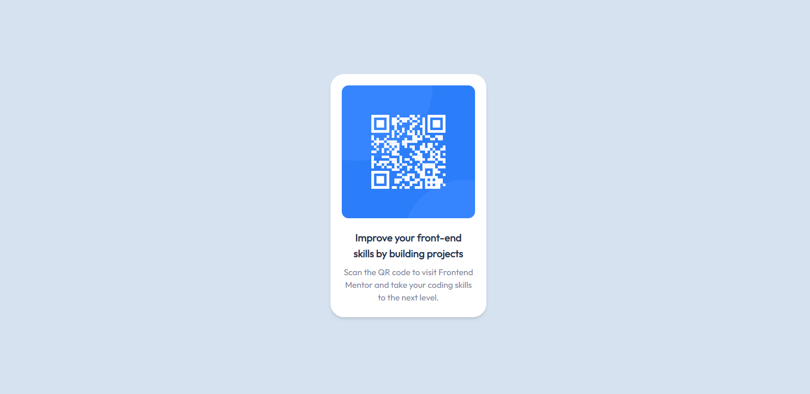

# Frontend Mentor - QR code component solution

This is a solution to the [QR code component challenge on Frontend Mentor](https://www.frontendmentor.io/challenges/qr-code-component-iux_sIO_H). Frontend Mentor challenges help you improve your coding skills by building realistic projects. 

## Table of contents

- [Overview](#overview)
  - [Screenshot](#screenshot)
  - [Links](#links)
- [My process](#my-process)
  - [Built with](#built-with)
- [Author](#author)

## Overview

### Screenshot

### Links

- Live Site URL: [https://qr-code-component-main-khaki-nu.vercel.app/](https://qr-code-component-main-khaki-nu.vercel.app/)

## My process

## Method
Initially I started out with making the card container to hold everything and made sure it looked proportional on mobile (as well as adding the screen background to make sure that I could see the card edges more easily while creating it). THen I added the QR code image and added relevant padding, border radius etc. After that, I added the text and tried to match the text size according to what the image looks like and the style guide.

Once all of that was done, I started playing around with padding and grid row sizing to make sure the text was spaced properly proportional to the image and card edge. Once everything else had been finished, I added the relevant colours and added large TailwindCSS utility classes to make sure that it would still look good on desktop screens.

### Built with

- Semantic HTML5 markup
- Mobile-first workflow
- React.js
- TailwindCSS

## Author

- Website - [Josh Mo](https://joshmo.dev)
- Frontend Mentor - [@joshua-mo-143](https://www.frontendmentor.io/profile/joshua-mo-143)
- Twitter - [@joshmo_dev](https://www.twitter.com/joshmo_dev)